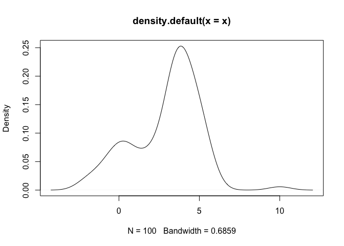
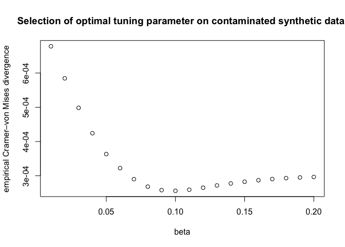
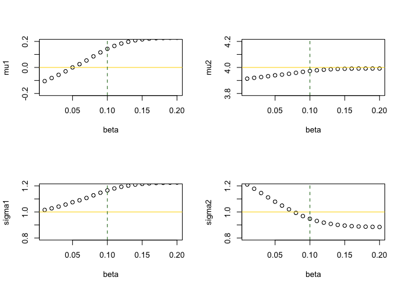

<!-- README.md is generated from README.Rmd. Please edit that file -->

# robustGMM

<!-- badges: start -->
<!-- badges: end -->

The goal of robustGMM is to implement the robust Gaussian Mixture Model
(GMM) estimation based on [Fujisawa and Eguchi,
2006](https://doi.org/10.1016/j.jspi.2005.03.008).

## Installation

You can install the development version of robustGMM from
[GitHub](https://github.com/) with:

``` r
# install.packages("devtools")
devtools::install_github("ge-li/robustGMM")
```

## Example

This is a basic example which shows you how to solve a common problem:

``` r
## Generate a 2-component mixture 
library(robustGMM)
set.seed(404)
lambda <- c(0.25, 0.75)
mu <- c(0, 4)
sigma <- c(1, 1)
x <- rnormix(n=100, lambda, mu, sigma)
x[which.max(x)] <- 10 # outlier
plot(density(x))
```



The standard EM algorithm will give estimation results as follows:

``` r
standard_mod <- mixtools::normalmixEM(x, lambda, mu, sigma)
#> number of iterations= 23
standard_mod$lambda
#> [1] 0.2349909 0.7650091
standard_mod$mu
#> [1] -0.128685  3.906640
standard_mod$sigma
#> [1] 1.003697 1.244186
```

The robust EM algorithm in this package will give:

``` r
robust_mod <- robustGMM(x, lambda, mu, sigma, beta=0.1, verbose=TRUE)
#> 
#> ── Fitting Robust Gaussian Mixture Model ───────────────────────────────────────
#> ℹ Iter:    0, Beta-likelihood:     7.462102
#> ℹ Iter:    1, Beta-likelihood:     7.464625
#> ℹ Iter:    2, Beta-likelihood:     7.464909
#> ℹ Iter:    3, Beta-likelihood:     7.465083
#> ℹ Iter:    4, Beta-likelihood:     7.465208
#> ℹ Iter:    5, Beta-likelihood:     7.465299
#> ℹ Iter:    6, Beta-likelihood:     7.465365
#> ℹ Iter:    7, Beta-likelihood:     7.465414
#> ℹ Iter:    8, Beta-likelihood:     7.465451
#> ℹ Iter:    9, Beta-likelihood:     7.465478
#> ℹ Iter:   10, Beta-likelihood:     7.465498
#> ℹ Iter:   11, Beta-likelihood:     7.465513
#> ℹ Iter:   12, Beta-likelihood:     7.465524
#> ℹ Iter:   13, Beta-likelihood:     7.465532
#> ℹ Iter:   14, Beta-likelihood:     7.465538
#> ℹ Iter:   15, Beta-likelihood:     7.465543
#> ℹ Iter:   16, Beta-likelihood:     7.465547
#> ℹ Iter:   17, Beta-likelihood:     7.465549
#> ℹ Iter:   18, Beta-likelihood:     7.465551
#> ℹ Iter:   19, Beta-likelihood:     7.465553
#> ℹ Iter:   20, Beta-likelihood:     7.465554
#> ✔ Iter:   21, Beta-likelihood:     7.465555
robust_mod$lambda
#> [1] 0.2787902 0.7212098
robust_mod$mu
#> [1] 0.1430803 3.9728562
robust_mod$sigma
#> [1] 1.1657071 0.9474814
```

## Selection of tuning parameter

``` r
betas <- seq(0.01, 0.2, by=0.01)
div <- numeric(0)
for (beta in betas) {
  div <- c(div, loo_cvm_div(x, lambda, mu, sigma, beta))
}
```

``` r
plot(betas, div, xlab="beta", ylab="empirical Cramer–von Mises divergence", 
     main="Selection of optimal tuning parameter on contaminated synthetic data.")
```



``` r
res <- purrr::map_dfr(betas, ~unlist(robustGMM(x, lambda, mu, sigma, .)))
res
#> # A tibble: 20 × 8
#>    lambda1 lambda2       mu1   mu2 sigma1 sigma2  beta l_beta
#>      <dbl>   <dbl>     <dbl> <dbl>  <dbl>  <dbl> <dbl>  <dbl>
#>  1   0.239   0.761 -0.105     3.91   1.02  1.21   0.01  97.0 
#>  2   0.243   0.757 -0.0813    3.92   1.03  1.18   0.02  47.1 
#>  3   0.247   0.753 -0.0568    3.93   1.04  1.15   0.03  30.4 
#>  4   0.251   0.749 -0.0296    3.93   1.06  1.11   0.04  22.2 
#>  5   0.256   0.744  0.000215  3.94   1.07  1.08   0.05  17.2 
#>  6   0.260   0.740  0.0254    3.94   1.09  1.05   0.06  13.9 
#>  7   0.265   0.735  0.0535    3.95   1.11  1.02   0.07  11.6 
#>  8   0.270   0.730  0.0852    3.96   1.13  0.993  0.08   9.87
#>  9   0.274   0.726  0.116     3.97   1.15  0.968  0.09   8.53
#> 10   0.279   0.721  0.143     3.97   1.17  0.947  0.1    7.47
#> 11   0.282   0.718  0.165     3.98   1.18  0.931  0.11   6.60
#> 12   0.285   0.715  0.184     3.98   1.19  0.918  0.12   5.89
#> 13   0.288   0.712  0.197     3.99   1.20  0.908  0.13   5.28
#> 14   0.289   0.711  0.208     3.99   1.21  0.900  0.14   4.78
#> 15   0.291   0.709  0.216     3.99   1.22  0.895  0.15   4.34
#> 16   0.292   0.708  0.221     3.99   1.22  0.891  0.16   3.96
#> 17   0.292   0.708  0.225     3.99   1.22  0.888  0.17   3.63
#> 18   0.293   0.707  0.226     3.99   1.22  0.887  0.18   3.33
#> 19   0.293   0.707  0.227     3.99   1.22  0.885  0.19   3.08
#> 20   0.293   0.707  0.228     3.99   1.23  0.885  0.2    2.85
```

``` r
par(mfrow=c(2, 2))
plot(mu1 ~ beta, res, ylim=c(mu[1]-0.2, mu[1]+0.2))
abline(h = mu[1], col="gold")
abline(v = betas[which.min(div)], col="darkgreen", lty=2)
plot(mu2 ~ beta, res, ylim=c(mu[2]-0.2, mu[2]+0.2))
abline(h = mu[2], col="gold")
abline(v = betas[which.min(div)], col="darkgreen", lty=2)
plot(sigma1 ~ beta, res, ylim=c(sigma[1]-0.2, sigma[1]+0.2))
abline(h = sigma[1], col="gold")
abline(v = betas[which.min(div)], col="darkgreen", lty=2)
plot(sigma2 ~ beta, res, ylim=c(sigma[2]-0.2, sigma[2]+0.2))
abline(h = sigma[2], col="gold")
abline(v = betas[which.min(div)], col="darkgreen", lty=2)
```


